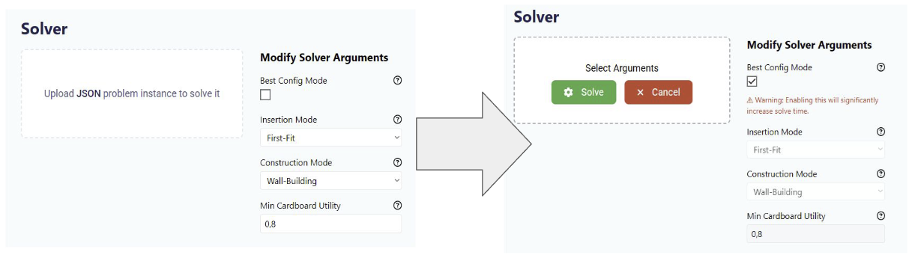

# MedRoPax

MedRoPax is a web-based software designed to address Heterogeneous Vehicle Routing Problems with 3D Loading (3LHVRP) and cardboard box packing. MedRoPax offers an automated solver for such problems. The problem constraints are based on practical
constraints in 3LHVRP. Interested readers
are referred to a comprehensive discussion
on practical 3LHVRP constraints in [[1]](#1).

MedRoPax uses a straightforward two-stage optimization method, where the box packing is solved in the first stage, and the remaining 3LHVRP is solved by Adaptive Large Neighborhood Search (ALNS) [[2]](#2) in the second stage. MedRoPax provides clear visualization of the generated routes, packing, and loading plans. It also generates the loading manifest to help warehouse staff load the supplies based on the generated loading plan. Finally, the flexible input customization allows for solving various operational scenarios and even other problem formulations.

# Setup

MedRoPax build system supports the Windows operating system. To setup MedRoPax, first, clone the source code from the GitHub repository:

```sh
git clone https://github.com/RakaSP/MedRoPax.git
```

After cloning, open the cloned "windows" directory and run the "setup.bat" batch file. This will automatically install and setup all of the dependencies and environments that MedRoPax needs to successfully run.

# How to Use MedRoPax

## Starting the Software

After MedRoPax has been setup, users can start the software by running the "run.bat" batch file, located in the "windows" directory. The home page of the software will automatically open in your default browser, at the address [http://localhost:3000](http://localhost:3000).
In the home page, users can log into one of four different account pages.

## Solver Account

A problem instance file contains all relevant information needed to solve a 3LHVRP with cardboard box packing problem instance.
Such a file is kept in the JSON format, with an example can be seen below:

```json
{
  "max_duration": 480,
  "product_types": [
    {
      "id": 1,
      "weight": 15,
      "length": 2,
      "width": 1,
      "height": 3,
      "need_refrigeration": true,
      "is_fragile": true
    },
    {
      "id": 2,
      "weight": 10,
      "length": 2,
      "width": 1,
      "height": 3,
      "need_refrigeration": true,
      "is_fragile": false
    }
  ],
  "vehicles": [
    {
      "id": 1,
      "length": 10,
      "width": 10,
      "height": 10,
      "max_weight": 1000,
      "is_reefer": false,
      "fixed_cost": 100,
      "variable_cost": 2
    },
    {
      "id": 2,
      "length": 10,
      "width": 10,
      "height": 10,
      "max_weight": 2000,
      "is_reefer": true,
      "fixed_cost": 200,
      "variable_cost": 4
    }
  ],
  "customers": [
    { "id": 1, "ordered_product_types": [1, 2, 2] },
    { "id": 2, "ordered_product_types": [1, 2] }
  ],
  "distance_matrix": [
    { "origin_node_id": 0, "destination_node_id": 1, "distance": 100 },
    { "origin_node_id": 0, "destination_node_id": 2, "distance": 50 },
    { "origin_node_id": 1, "destination_node_id": 0, "distance": 150 },
    { "origin_node_id": 1, "destination_node_id": 2, "distance": 40 },
    { "origin_node_id": 2, "destination_node_id": 0, "distance": 80 },
    { "origin_node_id": 2, "destination_node_id": 1, "distance": 160 }
  ]
}
```

In the solver account page, users can upload a problem instance file that the users wish to solve, as can be seen in the figure below. The solver will then automatically solve the problem instance and keeps the solution in local memory. To visualize and analyze the solution, users should then log into the remaining accounts in the software, which will be explained in the following subsections.

<div style="text-align: center;">

</div>

## Admin Account

The admin account page gives a high level overview of the solution data based on the solved problem instance, which consist of

- The list of vehicles, along with their capacity, refrigeration capabilities, usage, etc.
- The list of shipments, along with their cost, weight, distance, delivery times, etc.
- The list of orders, along with their price, customer location, delivery times, etc.
- The list of reported delivery troubles by drivers.

## Packer Account

The packing plans can be accessed
in the packer page. We can insert the customer's ID on that page to retrieve the packing information.
There are two submenus for each customer: the cardboard packing submenu
and the vehicle loading, as can be seen in the figures below.

<div style="text-align: center;">

</div>
<div style="text-align: center;">

</div>

In each submenu, an interactive visual
guides the staff on how each product
should be positioned, and how each cardboard box should be
loaded into the vehicle. By operating the
backward and forward buttons, the user can see
how the products were placed one by one into the cardboard
boxes. For cardboard
box packing, we deem this visual guide
sufficient because
each cardboard box is not big, and
contains only a limited number of products.

The visual aid for loading the cardboard boxes differs
slightly from the visual aid for packing the products.
The main difference is the green arrow that points to the
compartment door. The relative position of the products
to the compartment door is critical because it determines
their order of unloading. As described previously,
the unloading order that aligns with
the route is highly preferred to ensure smooth unloading.

We acknowledge that the visual guide
for the vehicle loading may not be enough
to guide the user, typically the warehouse staff. Therefore,
we added a feature to print a simple loading manifest
based on the generated packing plan. The loading manifest
can be downloaded by pressing the ``Download Guidebook''
button at the upper-right corner.
The format of the load manifest is based on the actual
load manifest used by an Indonesian medical supplies distributor
company. An example of the auto-generated loading manifest
is shown in the figure below.
The format is simplified because several details
are omitted to honor the company's privacy.

<div style="text-align: center;">

</div>

The company uses a simple heuristic when loading cargo
into each vehicle. Given an ordered list of
cargo to be loaded, the staff will load the cargo
one by one, starting from the first on the list
into the deepest possible position (or furthest from
the compartment's door along the x-axis).
If multiple such positions exist, the lowest
possible position is chosen (along the z-axis). If multiple such
positions exist, the left-most (along the y-axis) is chosen.
To further clarify the loading plan, the position of
each cargo is also supplied in the loading manifest.

## Driver Account

Apart from the packing and loading plans, the routes are accessible on the driver page.
By choosing a specific vehicle,
we can access its route, visualize its route on
Google Maps as shown in the figure below.
On this page, we can also see the total traveling distance
and time.

<div style="text-align: center;">

</div>

# License

This project is licensed under the MIT License - see the [LICENSE](LICENSE) file for details.

# References todo

<a id="1">[1]</a>
C. Krebs, J. F. Ehmke, H. Koch, Advanced loading constraints for 3d
vehicle routing problems, OR Spectrum 43 (4) (2021) 835–875. doi:
[10.1007/s00291-021-00645-w](https://doi.org/10.1007/s00291-021-00645-w).

<a id="2">[2]</a>
L. Wei, Z. Zhang, A. Lim, An adaptive variable neighborhood search for a
heterogeneous fleet vehicle routing problem with three-dimensional load-
ing constraints, IEEE Computational Intelligence Magazine 9 (4) (2014)
18–30. doi:[10.1109/MCI.2014.2350933](https://doi.org/10.1109/MCI.2014.2350933).

# Under Maintenance

The packing guide PDF generation and admin pages are currently under maintenance and rehaul, and hence are deactivated
